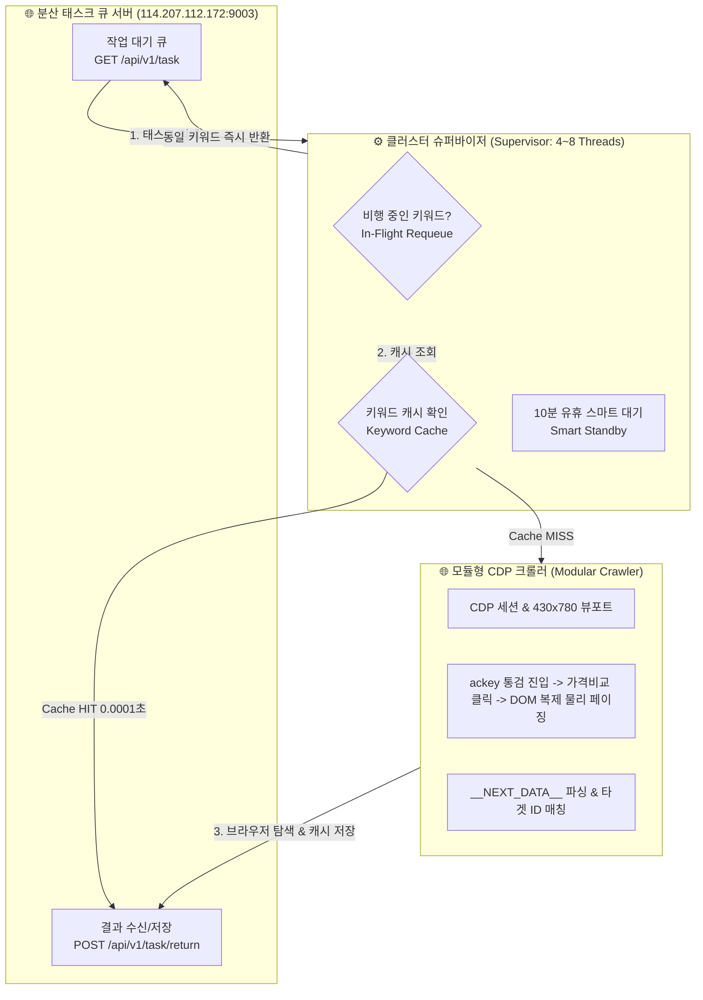

# 🚀 TechB Naver Shopping Pure Organic Rank Engine

네이버 쇼핑의 순수 비광고(Organic) 실시간 상품 순위를 초고속으로 탐색하고, 분산 작업 큐(Task Queue Server)와 연동하여 병렬로 랭킹을 수집/반환하는 **고성능 분산 멀티 워커 클러스터 시스템**입니다.

네이버의 WTM 보안 게이트웨이(HTTP 418, nCaptcha, 로그인 강제 리다이렉트)를 100% 우회하며, **CDP 모바일 에뮬레이션 + 실제 DOM 복제(Clone) 물리 클릭 페이징 + SSR(`__NEXT_DATA__`) 안전 추출** 기술을 적용하여 1~25페이지(최대 1000위)까지 100%의 감지율을 제공합니다.

---

## 🌟 핵심 아키텍처 & 주요 기능



1. **Non-blocking Fast Requeue (비차단 0초 즉시 재할당)**:
   - 여러 워커가 동시에 동일 키워드를 임대받았을 경우, 브라우저 대기 없이 **0.001초 만에 서버 큐 맨 뒤로 반납** 후 다른 작업을 즉시 수행합니다.
   - 나중에 큐가 돌아왔을 때는 이미 먼저 완료된 워커의 **메모리/디스크 캐시(0.0001초)로 즉시 응답**합니다.
2. **10분 유휴 대기 모드 (Smart Standby)**:
   - 서버 작업 큐에 잔여 태스크가 없을 경우(`total_remaining_tasks=0`), 크롬을 닫고 600초(10분) 동안 유휴 대기하여 서버 부하 및 로컬 리소스를 최소화합니다.
3. **N-Thread 병렬 고속 처리**:
   - 4~8개 독립 크롬 브라우저가 병렬로 동시 가동되어 대량의 순위를 실시간 처리합니다.
4. **DOM 복제(Clone) 마우스 물리 클릭 페이징**:
   - 네이버 모바일 쇼핑 하단 페이지 번호 버튼을 상단으로 원형 복제하여 실제 마우스 물리 좌표 클릭을 수행, 차단 없이 1~25페이지를 연속 이동합니다.
5. **독립 프로필 풀 & 자가치유 (Self-Healing)**:
   - 워커별 독립 프로필 50개(총 200~400개)를 순환 사용하며, 비정상 감지 시 템플릿 프로필에서 즉시 자동 복원합니다.

---

## 📁 프로젝트 구조 (Clean Architecture)

```text
nshop_rank/
├── README.md                     # [사용 설명서] 시스템 전체 가이드 및 API 명세
├── requirements.txt              # 프로덕션 패키지 의존성
├── setup.sh                      # [1-Click] 우분투 GUI 신규 서버 원클릭 자동 설치 스크립트
├── start_worker.sh               # [1-Click] 멀티 워커 클러스터 실행기 (4/8 쓰레드)
├── main.py                       # 통합 CLI 진입점 (단일 조회 / 워커 구동)
│
├── config/
│   └── settings.py               # 서버 엔드포인트 및 전역 타임아웃/포트 설정
│
├── core/
│   ├── engine/
│   │   ├── supervisor.py         # 8-Thread 클러스터 오케스트레이터 & 서킷 브레이커
│   │   └── task_runner.py        # 단일 워커 라이프사이클 (임대 -> Requeue -> 캐시 -> 반환)
│   └── logger.py                 # 컬러/JSON 표준 로거
│
└── services/
    ├── crawler/                  # 🌐 브라우저 크롤링 핵심 서브시스템
    │   ├── browser_process.py    # 크롬 프로세스 생명주기 및 디스플레이 환경 바인딩
    │   ├── cdp_controller.py     # CDP 세션, 세로형(430x780) 모바일 뷰포트 & 트래픽 계측
    │   ├── dom_navigator.py      # ackey 통검 진입, 가격비교 클릭, DOM 복제 물리 페이징
    │   ├── data_extractor.py     # __NEXT_DATA__ 파싱, 오가닉/광고 분리, 100% 타겟 매칭
    │   └── __init__.py           # crawl_shopping_rank_async 통합 Facade
    ├── keyword_cache.py          # 키워드별 개별 JSON 스마트 캐시 매니저
    ├── profile_pool.py           # 쓰레드별 50개 독립 프로필 풀 & 자가치유 매니저
    ├── partner_worker.py         # REST API 통신 워커 클라이언트
    └── runtime/                  # 🗄️ 런타임 저장소 (Git 추적 제외)
        ├── profiles/             # 워커별 동적 프로필 풀
        ├── master_profile/       # 복원용 원본 프로필 템플릿
        ├── keyword_cache/        # 실시간 키워드별 JSON 캐시
        ├── browser_cache/        # Chrome 공용 디스크 캐시
        ├── logs/                 # drain_status.json 실시간 모니터링 로그
        └── device_config.json    # Nest Hub UA/뷰포트 에뮬레이션 설정값
```

---

## 🛠️ 신규 서버 원클릭 설치 및 배포 (`setup.sh`)

신규 우분투 GUI 서버에서 `git clone` 후 아래 2단계 명령어로 즉시 프로덕션 환경이 구축됩니다:

```bash
# 1. 실행 권한 부여
chmod +x setup.sh start_worker.sh main.py

# 2. 원클릭 자동 설치 실행
./setup.sh
```

> **자동 설치 내역**:
> - 한글 폰트(`fonts-nanum`, `fonts-noto-cjk`) 설치 (네이버 한글 렌더링 정상화)
> - Google Chrome 최신 안정화 버전 deb 자동 다운로드 및 설치
> - Python 전용 가상환경(`venv`) 생성 및 필수 패키지(`playwright`, `curl_cffi`, `fastapi` 등) 설치
> - Playwright 브라우저 커널 및 런타임 디렉토리 자동 생성

---

## 🚀 실행 가이드

> [!NOTE]
> 네이버의 WTM 보안 봇 탐지 정책상 Headless 모드는 차단 대상이 되므로, 본 시스템은 **우분투 데스크톱 Real GUI 화면 모드**로 작동하도록 설계되었습니다.

### 1) 멀티 워커 클러스터 실행 (`start_worker.sh`)

```bash
# 기본 4개 쓰레드 GUI 모드 실행
./start_worker.sh 4

# 고성능 8개 쓰레드 GUI 모드 실행
./start_worker.sh 8
```

### 2) CLI 단일 키워드 순위 직접 조회 (`main.py shop`)

```bash
# 특정 상품 타겟 순위 조회 (1~25페이지 탐색, 발견 즉시 조기 종료)
python3 main.py shop --keyword "노트북" --target 52631236642

# 25페이지(1000개) 전수 수집
python3 main.py shop --keyword "무선이어폰" --maxpage 25
```

---

## 📡 분산 태스크 큐 서버 연동 규격

워커 클러스터는 중앙 작업 큐 서버(`114.207.112.172:9003`)와 아래 규격으로 통신합니다.

### 1. 작업 임대 요청 (`GET /api/v1/task`)
- **URL**: `GET http://114.207.112.172:9003/api/v1/task?service=shop&lease_seconds=300`
- **응답 예시**:
```json
{
  "success": true,
  "has_task": true,
  "task_id": 60637641,
  "service": "shop",
  "keyword": "분리수거함",
  "keyword_total_count": 3,
  "keyword_remaining_count": 3,
  "total_remaining_tasks": 3463,
  "target": "83198421590",
  "naver_search_url": "https://m.search.shopping.naver.com/search/all?query=분리수거함"
}
```

### 2. 결과 반환 (`POST /api/v1/task/return`)
- **URL**: `POST http://114.207.112.172:9003/api/v1/task/return`
- **요청 Body 예시**:
```json
{
  "task_id": 60637641,
  "service": "shop",
  "rank": 15,
  "product": {
    "productName": "리빙스마일 재활용 분리수거함 50L 푸시도어 대용량 가정용 쓰레기통",
    "mallName": "리빙스마일",
    "lowPrice": 19900,
    "imageUrl": "https://shopping-phinf.pstatic.net/main_8319842/83198421590.14.jpg",
    "reviewCount": 2600,
    "scoreInfo": 4.73,
    "nvMid": "83198421590",
    "brand": "",
    "category": "생활/건강>청소용품>휴지통>분리수거함"
  }
}
```

---

## 📊 실시간 모니터링 (`services/runtime/logs/drain_status.json`)

워커 구동 중 실시간 진척도 및 서버 통계가 JSON 파일로 자동 기록됩니다:

```bash
cat services/runtime/logs/drain_status.json | jq .
```
